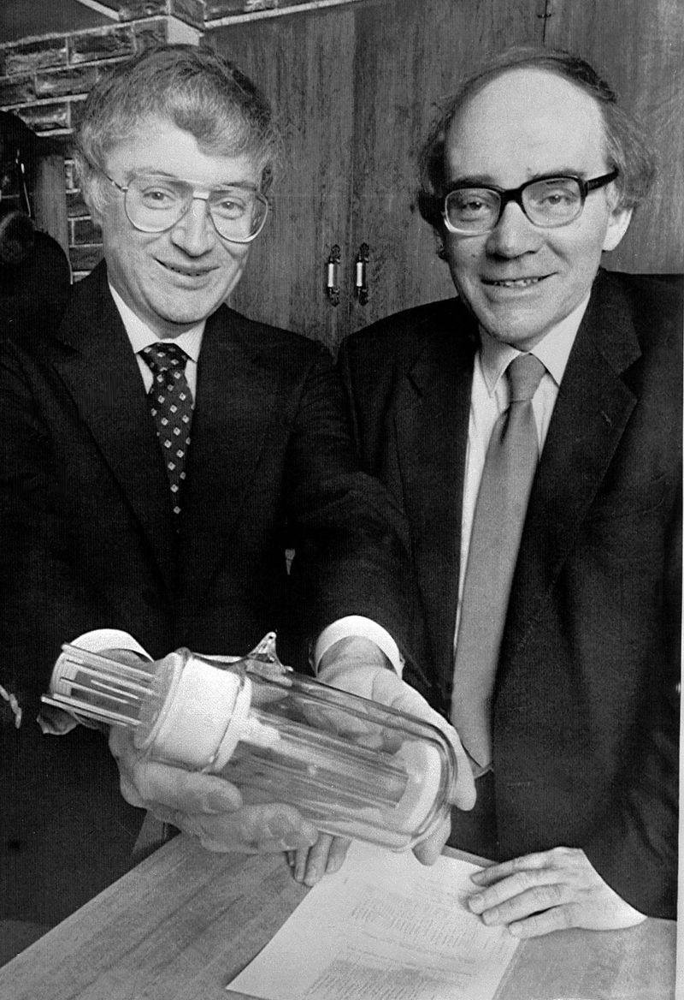

+++
author = "Matt Lilley"
title = "Cold fusion"
date = "2017-04-09"
tags = [
    "science"
]
subtitle="A very brief history"
series = ["Cold fusion (LENR)"]
description="As with many people, cold fusion was thrust into my awareness in 2011 when Andrea Rossi claimed to have demonstrated cold fusion using nickel and hydrogen. Preoccupied by my own hot fusion research I didn't pay much attention to the story. It's now 2017 and after finishing a long standing tech project, Squidler, I'm ready to take another look at cold fusion."
toc = true
+++

On March 23rd 1989 Martin Fleischmann and Stanley Pons stunned the world by announcing that had achieved fusion at room temperature on a table-top chemistry experiment - so called ["cold fusion"](https://www.youtube.com/watch?v=HjvL4zNLOGw). This experiment involved conducting electricity through heavy water and into solid palladium metal (electrolysis) - something that a high school student could in principle do. This was not the first time such claims were made. In 1927, Swedish scientist J. Tandberg also claimed that he had fused hydrogen into helium in an electrolytic cell with palladium electrodes [^1].

Despite the apparent simplicity, the experiments were difficult to reproduce and took 10 weeks to perform. Experimental replications were made over many months in reputable labs, e.g. [Los Alamos](https://www.deseretnews.com/article/78011/LOS-ALAMOS-VERIFIES-TRITIUM-PRODUCTION-IN-COLD-FUSION-TESTS.html) and [SRI international](https://pdfs.semanticscholar.org/b2ab/364ef13574f30b41ef87cf8fa69e2c25dcff.pdf), but failed replication attempts done over several days at [MIT](https://link.springer.com/article/10.1007/BF02627578) and [Caltech](https://www.nature.com/articles/340525a0) were more influential. They added to an already growing criticism of the poor communication and high ambiguity of some of the initial results.

As for a possible mechanism for cold fusion, not only did fusion physicists consider it impossible to produce useful amounts of fusion at low temperatures, but the expected fusion radiation would have killed anyone in the lab. Reasonable scepticism turned into dogmatic opposition where cold fusion scientists were [ridiculed in public](https://youtu.be/pK94vmpB6Y0?t=1304) and accused of being [incompetent, delusional](https://web.archive.org/web/20220902044906/https://archive.nytimes.com/www.nytimes.com/library/national/science/050399sci-cold-fusion.html) and [fraudulent](https://web.archive.org/web/20111014223621/https://newenergytimes.com/v2/sr/ColdFusion1989/MIT/OnTheAllegationsOfFraud.shtml). 

Despite the words of Nobel prize winner and theoretical nuclear physicist, Julian Schwinger, who cautioned ["The circumstances of cold fusion are not those of hot fusion"](https://lilley.io/uploads/Schwinger-ProgressReport-1991-InfEnergy.pdf), the community had made up its mind. Mainstream journals quickly [stopped accepting cold fusion papers for review](https://en.wikipedia.org/wiki/Cold_fusion#Publications) and research drifted into the fringe.

Today, cold fusion research is often called [Low Energy Nuclear Reactions](https://lenr-canr.org/) (LENR). Reports of anomalies in metal-hydrogen system continue to accumulate but we still don't have a fully reproducible experiment - why? That's the million dollar question! And I'd like to be part of the effort to answer it.

As with many people, cold fusion was thrust into my awareness in 2011 when [Andrea Rossi claimed to have demonstrated cold fusion](https://phys.org/news/2011-01-italian-scientists-cold-fusion-video.html) using nickel and hydrogen. Preoccupied by my own hot fusion research I didn't pay much attention to the story.

The cold fusion story came back to me at the end of 2015 when a friend shared the book [Excess Heat: Why Cold Fusion Research Prevailed](https://newenergytimes.com/v2/books/excessheat/ExcessHeat.shtml) by Beaudette. The provocative title notwithstanding, this book blew my mind and I became convinced this was an area of research that I wanted to be part of. High risk yes, but the potential seemed far greater than the hot fusion research that I'd previously been involved in. For example, home sized reactors didn't seem out of the question 😱. My friends and I got so excited that in 2016 we pitched to some "business types" in an attempt to raise some cold fusion money.

It's now 2017 and after finishing a long standing tech project, Squidler, I'm ready to take another look at cold fusion. My first action item is to reach out to some researchers in the field. On my list, Peter Hagelstein and Michae McKubre. Let's hope they respond.

Wish me luck.

[^1]: J. Tandberg, “Method for producing Helium,” Swedish patent application (1927). 