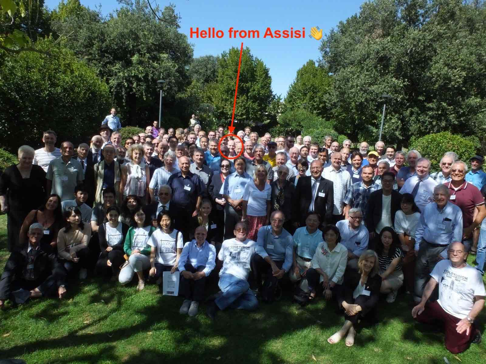
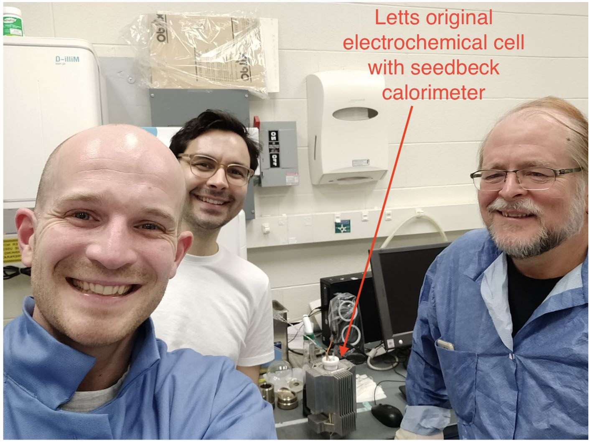

+++
author = "Matt Lilley"
title = "The road to deuterium"
date = "2019-11-29"
tags = [
    "science"
]
subtitle="Next steps in my cold fusion experiments"
series = ["Cold fusion (LENR)"]
description="It's been 3 months since I did my first cold fusion experiment. I've open sourced my research, been on a cold fusion conference, made some new collaborators and have acquired some heavy water that's going to supercharge my experiments."
toc = true
+++

It's been 3 months since I did my [first cold fusion experiment](). If you've been following @CasualPhysics on [YouTube](https://www.youtube.com/playlist?list=PLjvHqB5pIFEzQ7qfOdoxW60B0F7OThnW-) and [Twitter](https://twitter.com/CasualPhysics) then you'll know I've been busy. 

I open-sourced all my cold fusion work on the [lilley-lenr Gitlab repository](https://gitlab.com/mklilley/lenr) and moved my [experimental log](https://gitlab.com/mklilley/lenr/-/issues) there too.

I went to my first cold fusion (LENR) conference - [ICCF22](https://iscmns.org/iccf22/) - in September in beautiful Asissi, Italy and I got to meet some of the big names in the field who've influenced me a lot e.g. Peter Hagelstein and Mike McKubre. 

The [research was diverse](https://iscmns.org/iccf22/program/), e.g. Condensed plasmoids ([Jaitner](https://www.youtube.com/watch?v=Gl9paQbjywk&list=PLpEPF2v_du9RBqvUxxOpoO2GSquUjzn2r)), Palladium thin films on Nickel foam ([Mastromatteo](https://www.youtube.com/watch?v=-gZrlxsFT7M&list=PLpEPF2v_du9RBqvUxxOpoO2GSquUjzn2r)), Nano powders with hydrogen ([Iwamura](https://www.youtube.com/watch?v=PwWLcmNieVY&list=PLpEPF2v_du9RBqvUxxOpoO2GSquUjzn2r)), Nuclear excitation transfer ([Metzler](https://www.youtube.com/watch?v=dDIZF9T9Umo&list=PLpEPF2v_du9RBqvUxxOpoO2GSquUjzn2r)) to name but a few! Incredibly inspirational to see all this work and to make some new connections.

Off the back of ICCF22, one of my new collaborators, Florian Metzler, invited me to come out to MIT. I was an incredible experience to see the diversity of LENR experiments they've got going on, e.g. electrochemical, ion-beam, excitation transfer, and I got to help out in one of their experiments to replicate the work of Letts [^1]

We also talked about possibly of working on some theory work together in an attempt to try and make some VERY complex ideas more accessible to larger audiences. That would be super exciting...but it's not for now... I've still have to finish off my own experiments!

On that topic, in late October, I finally sat down to analyse the data from my first experiment and answer the question did I made cold fusion happen?:



Long story short - no I did not make cold fusion happen and you can check out the full analysis of that on the [lilley-lenr repo](https://gitlab.com/mklilley/lenr/-/blob/work-in-progress/code/20190823-NiMesh-PdBurnish-H/temperature-modelling.ipynb). 

The negative result is not unexpected. Most people who've had success in cold fusion have used deuterium instead of hydrogen. Deuterium is an isotope of hydrogen that accounts for approximately 0.0156% of all the naturally occurring hydrogen in sea water. Although the oceans are vast and there is a LOT of deuterium in the world, it's still rare enough to make it expensive and that's why I didn't use it so far.

The time has now come to up my cold fusion game and "power up" my reactor with deuterium (technically I'll be using heavy water - D2O - to make the deuterium on demand). 

I've been blown away by the support I've received on my [GoFundMe campaign](https://www.gofundme.com/f/heavy-water-needed-for-cold-fusion-research) to raise money to buy the heavy water I need for my next experiments.



Once the new deuterium generator is commissioned, then we'll be all set to be (hopefully) dazzled by deuterieum 🤞.

[^1]: [D. Letts, P. L. Hagelstein, Modified Szpak Protocol for Excess Heat, J. Condensed Matter Nucl. Sci. 6 (2012) 44–54](https://lenr-canr.org/acrobat/BiberianJPjcondensede.pdf#page=53)

