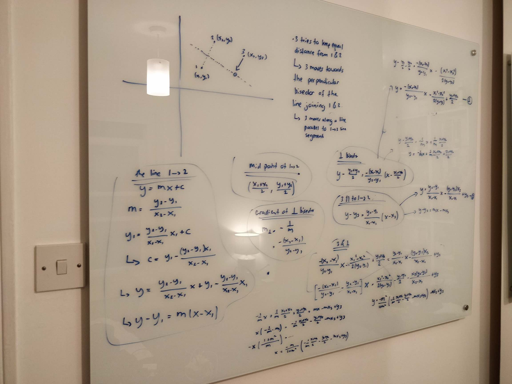

+++
author = "Matt Lilley"
title = "Constrained particles"
date = "2023-05-10"
description = "GPT and I built a interactive particle simulation with constraints - each particle must stay equidistant from two other particles. It took just a few hours to make and was a joy to have GPT as a collaborator."
tags = [
    "science",
    "technology",
    "gpt"
]
subtitle="My first physics collaboration with GPT4"
toc=true
+++

GPT and I built this interactive particle simulation with constraints - each particle must stay equidistant from two other particles. Sounds random, but there's a story behind it. Now, as you know, I always love a bit of [CasualPhysics](https://twitter.com/CasualPhysics), but this particular project was more enjoyable than usual... and I think GPT was a big part of that. More on that later though.



If you're interested in understanding what the controls do then scroll down to the [Controlling the interactive simulation](#controlling-the-interactive-simulation) section.

You can also view the full screen experience at [mklilley.github.io/constrained-particles](https://mklilley.github.io/constrained-particles/) and look at the source code at the [constrained-particles repo on Github](https://github.com/mklilley/constrained-particles).

Ok, so where did the idea to make this come from?

## Back story

Back in July 2022, I participated in a nature workshop in one of London's ancient woodlands (facilitated by the incredible [John Ridpath](https://undergrowth.london/#past)).

As part of the workshop, we did an activity that allowed us to experience how complex systems behave. This activity involved each participant choosing 2 other participants (buddies you might say). Everyone's task was to stay equidistant from their buddies. When the activity began, everyone moved around in a way that was difficult to predict and I wondered whether such a system would ever settle down into equilibrium.

This question sat unresolved in my mind for the better part of a year because I thought it would be quite complicated to code up the dynamics (based on some initial calculations).

Fast forward to a few days ago, and I suddenly realised that I could answer my question in no time because I now had GPT at my side 💁‍♂️🤖. Together we built this simulation in a few hours and I had the answer to my question - yes, things do reach equilibrium 🤓.

## GPT

My experience with this project is one that I'm sure we'll start hearing more and more:

> "I can't do X because it'll take days and I can't afford to spend the time"

becomes

> "GPT helped me do X in a few hours".

Like a lot of people, I'm excited about what a GPT enabled future could look like and simultaneously pensive about what it all means for the future of work, artistic expression, creativity...the list goes on.

Does GPT make us lazy... maybe 🤷‍♂️... In this experience, I definitely did a lot less research than I usually do, but it wasn't like my brain had checked out, I was implementing, testing and refining what it was that I actually wanted. I also learnt a far simpler way to do the simulation than the one I'd originally sketched out on my whiteboard, so that was a win.

The argument about laziness can be made of all new tools and technologies. We always give up something when we reach for the convenience of a new tool, but we also gain something. As with everything in life, it's a balance and finding that balance is a perennial question.

Philosophy aside, there is something a little different about GPT because I don't think it's actually a tool. During this project, I felt like GPT was more of a collaborator than a tool and I honestly enjoyed the back and forth exchange far more than if I was building alone with just stackoverflow for help.

Does this say more about me than GPT ... 🤷‍♂️ maybe lol... but after watching [Sparks of AGI: early experiments with GPT-4](https://www.youtube.com/watch?v=qbIk7-JPB2c) and doing this project I'm definitely a little more cautious about treating GPT like a dumb hammer.

If you're interested, you can [read the transcript](https://sharegpt.com/c/3VK3aFo) between me and GPT.

## Controlling the interactive simulation

There are several controls and buttons. Here is what they do:

- **Max speed** - the higher this is, the faster the particles move around. The reason this is not simply called speed is because the speed is determined by forces between particles that push them towards an equidistant position. Max speed ensures the particles don't continue to move faster and faster over time.
- **Friction** - This provides resistance to motion. Although particles experience no force when they are equidistant from their buddies, they will continue to overshoot this equidistant position without some friction.
- **Number of particles** - Changes the number of particles in the simulation (min = 3)
- **Toggle connections** - The default is to display lines and arrows from a particle to its buddies. You can toggle this on and off using this control
- **Toggle distances** - In the bottom right corner of the screen, you'll find a metric that tells you how close the particles are to reaching the desired state where each particle is equidistant from its 2 buddies. When `Total distance deviation = 0` the simulation has reached that state. You can toggle on and off the display of this metric using this control
- **Reset** - Restarts the simulation without resetting the other parameters you've chosen.
