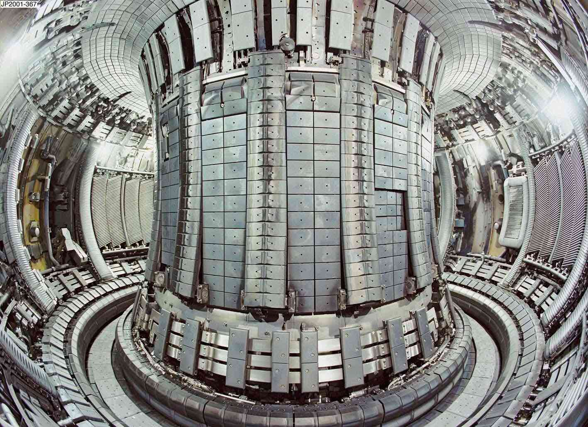

+++
author = "Matt Lilley"
title = "Instabilities in fusion plasmas"
date = "2014-08-21"
description = "To reach extreme fusion temperatures, energetic beams of particles are injected. Once the plasma “ignites”, energetic fusion products should heat the plasma in a self sustained way"
subtitle="A summary of my academic research"
tags = [
    "science"
]
toc = true
+++

## Magnetic confinement fusion

Magnetic confinement fusion relies on the idea that the motion of charged particles is restricted across regions of high magnetic field (due to the Lorentz force). A “magnetic bottle” can therefore be used to suspended a "soup" of positive and negative charges (plasma) away from cold material surfaces – allowing extremely high temperatures to be sustained (roughly 150,000,000 C).  Under such conditions, charged ions can overcome their mutual repulsion allowing nuclear fusion to occur – releasing energy in the process.  Various bottles have been proposed over the years but the torus (doughnut) is the shape currently favoured by the international fusion community and specifically the tokamak is the device currently receiving most attention (see [ITER project](https://en.wikipedia.org/wiki/ITER)).

## Energetic particle driven instabilities

To reach extreme fusion temperatures, energetic beams of particles are injected. Once the plasma “ignites”, energetic fusion products should heat the plasma in a self sustained way. Unfortunately, all these energetic particles also have a tendency to destabilise the plasma, reducing overall performance and potentially damaging material components. The overall aim of my research from 2009 - 2014 has been to gain an understanding of these instabilities and develop ways to mitigate any undesirable consequences.

### Thermodynamic equilibrium
A magnetically confined neutral plasma cannot be in thermodynamic equilibrium [^1]. As such, the plasma has a tendency to ripple and churn – using the naturally occurring electromagnetic oscillations to achieve some form of lower energy state. Energetic particles drive the plasma further away from thermodynamic equilibrium, creating more potential for instability [^2],[^3]. What we are now understanding is that the instabilities can be relatively benign, or more dramatic in character – it depends on the amount and type of collisions between the energetic particles and the plasma. Furthermore, the dissipative processes that one might initially expect to suppress instabilities are now understood to actually be enhancing them.

[^1]: [D. H. E. Dubin and T. M. O’Neil, Reviews of Modern Physics, 71, 87, (1999)](https://dx.doi.org/10.1103/RevModPhys.71.87)
[^2]:  [W. W. Heidbrink Physics of Plasmas 15, 055501, (2008)](https://dx.doi.org/10.1063/1.2838239)
[^3]: [W. W. Heidbrink and G.J. Sadler, Nuclear Fusion, 34, 535, (1994)](https://dx.doi.org/10.1088/0029-5515/34/4/I07)

You can learn more about my research by checking out some of my peer reviewed publications below, [downloading my CV](/lilleyCV.pdf) and [visiting my Google Scholar page](https://scholar.google.co.uk/citations?user=dJewyK0AAAAJ).

### Selected publications
- [Formation of Phase Space Holes and Clumps, Physical Review Letters, (2014)](https://dx.doi.org/10.1103/PhysRevLett.112.155002)
- [Adiabatic description of long range frequency sweeping, Nuclear Fusion, (2012)](https://dx.doi.org/10.1088/0029-5515/52/9/094020)
- [Convective transport of fast particles in dissipative plasmas near an instability threshold, Nuclear Fusion, (2012)](https://dx.doi.org/10.1088/0029-5515/52/9/094002)
- [Effect of dynamical friction on nonlinear energetic particle modes, Physics of Plasmas, (2010)](https://dx.doi.org/10.1063/1.3486535)
- [Destabilizing Effect of Dynamical Friction on Fast-Particle-Driven Waves in a Near-Threshold Nonlinear Regime, Physical Review Letters, (2009)](https://dx.doi.org/10.1103/PhysRevLett.102.195003)
- [Recent experiments on Alfven eigenmodes in MAST, Nuclear Fusion, (2008)](https://dx.doi.org/10.1088/0029-5515/48/8/084003)
- [Compressional Alfven and ion-ion hybrid modes in the deuterium-tritium plasma of a spherical tokamak power plant, Physics of Plasmas, (2007)](https://dx.doi.org/10.1063/1.2752824)
