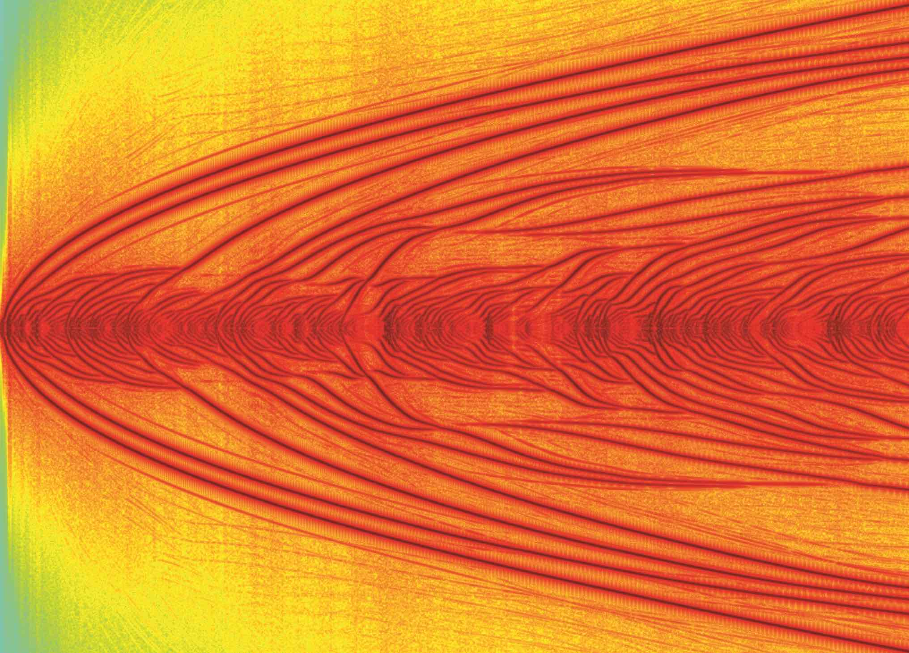
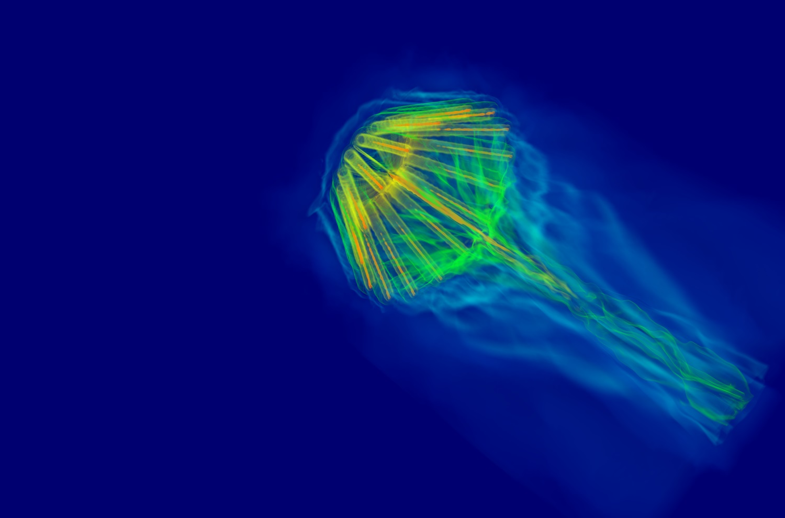
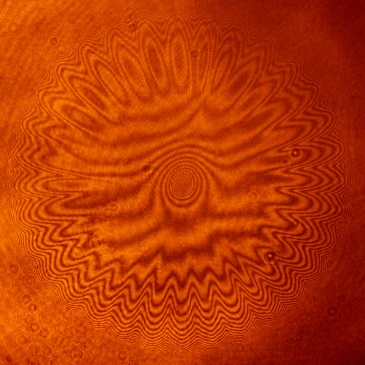
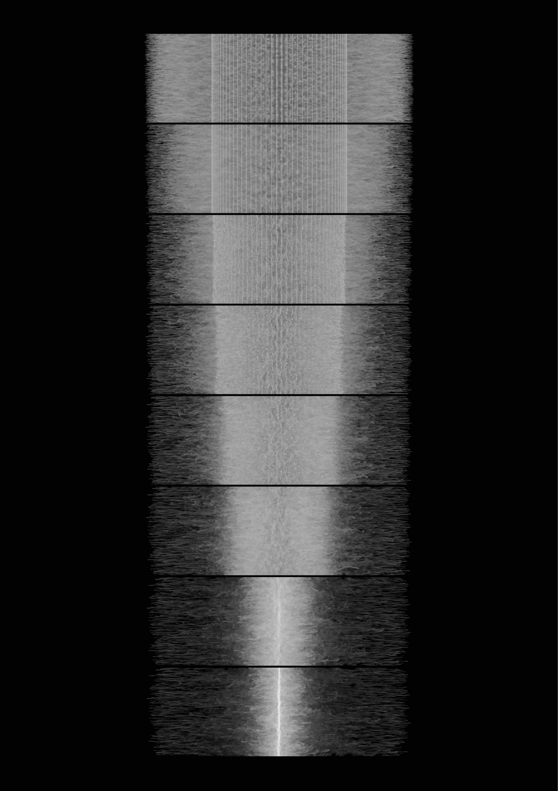
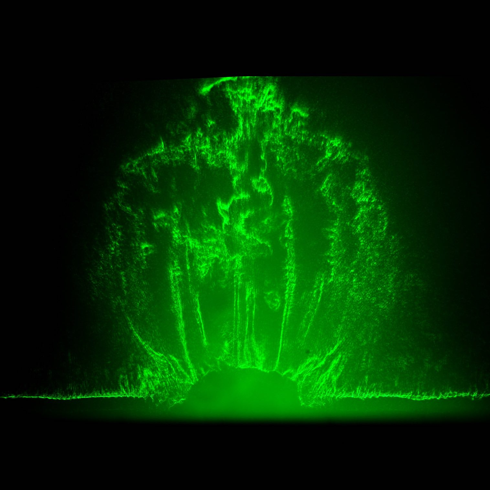
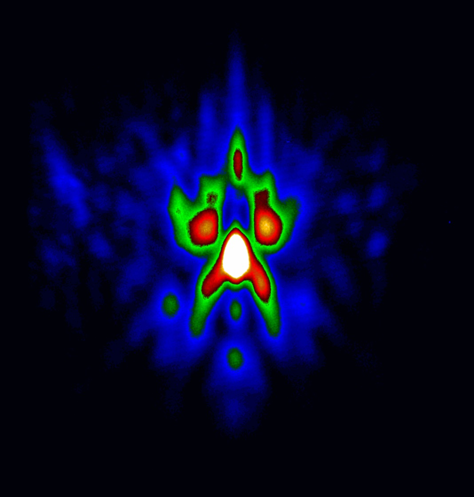
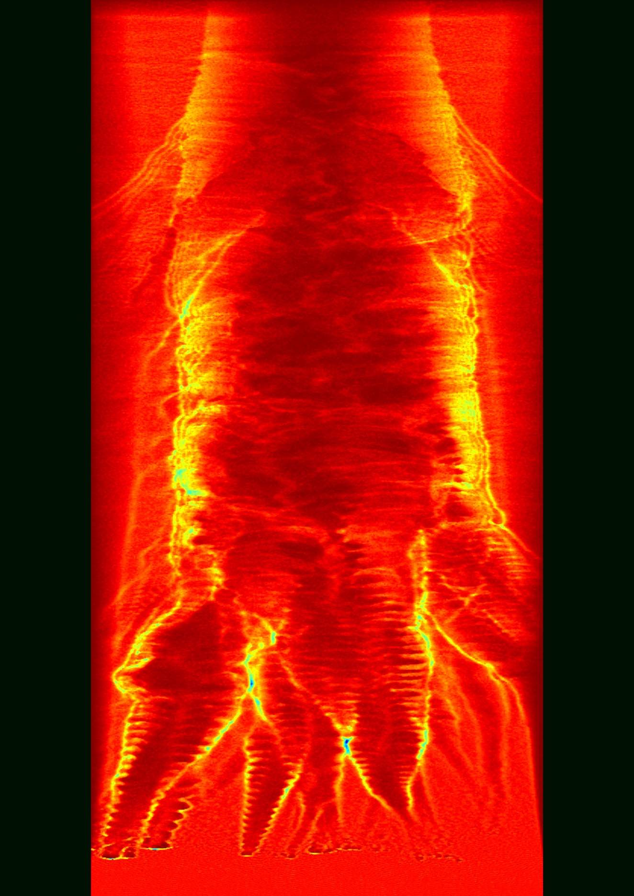

+++
author = "Matt Lilley"
title = "Plasma art"
date = "2014-09-23"
subtitle = "Sparking curiosity in science"
tags = [
    "science",
    "education"
]
toc = true
+++

The walls of physics departments are often lined with poster contributions from old conferences. The vast majority go without so much as a glance from visitors or fellow researchers. I wanted the walls of the plasma physics group at Imperial College London to be a showcase for research, but in a way that would be inspirational and a bit more accessible. The Plasma Art project was initiated with the aim of displaying large scale images that would simultaneously possess scientific and artistic qualities.

## Frequency chirping plasma waves

This image shows a spectrogram (frequency against time) from a simulation of a bump-on-tail plasma configuration in the presence of significant dissipation. Surprisingly, the dissipation process (that normally acts to stabilise the system) promotes the formation of long lived plasma waves whose frequency starts at the plasma frequency but then changes rapidly in time, producing what is known as a chirp. Such chirping patterns are regularly observed in Alfvén wave instabilities in tokamaks. <a rel="noopener" href="https://dx.doi.org/10.1063/1.3486535" target="_blank">Physics of Plasmas 17, 092305 (2010)</a>

## Conical wire array

This image shows a volume rendering of mass density taken from a numerical simulation, using the code GORGON, of a conical wire array with 16 Tungsten wires driven by the Magpie generator. A supersonic, radiatively cooled jet propagates along the axis of the array, displaying turbulent behaviour. Jets from conical arrays have dimensionless parameters close to the ones of protostellar jets, and are used for laboratory astrophysics studies.

## GeV betatron oscillations

This image shows a high-energy electron beam that was produced in a laser wakefield accelerator – a device where beams are accelerated inside a plasma.  The electron beam was dispersed by a magnetic spectrometer and allowed to hit a scintillator screen that was viewed with a digital camera to produce this image.  The oscillations in the spectrum, called betatron oscillations, are caused by the very strong focusing fields present within the wakefield.  These oscillations make the beams give off very bright x-rays.

## End-On Interferogram of a Wire Array

This image shows an end-on interferogram captured during an experiment to investigate ablation dynamics in Tungsten wire arrays. This array was made up of 32 wires. Variations in the refractive index across the array lead to the distortion of the fringes seen in this image. Analysis of these distortions allows us to calculate the free electron density distribution of the plasma.

## Nested Wire Array Z-pinch

Arrays of thin metallic wires are used to form light-weight cylinders of plasma which can be imploded using large currents. This image shows predicted radiographs from an MHD simulation of two concentric copper wire arrays imploded on the 20MA ‘Z’ generator at Sandia National Laboratory. The Rayleigh-Taylor instability can be seen growing in the plasma from the outer array and then imprinting upon the inner array. The simulation used 6.6 billion computational cells and ran on 4608 processors.

## Jet inside a ‘magnetic bubble’

The image shows the formation of a plasma jet on the axis of a ‘magnetic bubble’. The jet is driven by strong magnetic fields produced from the MAGPIE generator, which make the jet become unstable. The image was obtained using sub-ns exposure, dark-field laser Schlieren, showing the jet can reach axial velocities in excess of ~200 km/s. <a rel="noopener" href="https://dx.doi.org/10.1109/TPS.2009.2036730" target="_blank">IEEE Transactions on Plasma Science, 38, No. 4, (2010)</a>

## Plasma compression of a laser pulse

This image shows the time dependant spectrum of a high power laser pulse after exiting a laser driven plasma accelerator. The spectrum in the vertical axis and the time varies in the horizontal axis. This information can be used to track the evolution of the laser pulse as it propagates though a plasma channel. The pulse duration can be compressed down to 10 fs (10 millionths of a billionth of a second).

## Plasma filamentation

Numerical simulations of high-intensity laser-plasma interactions using a Particle-in-Cell (PIC) code, showing the formation of an electron channel that progresses through a plasma with high electron density (ne = 1020 electrons/cm3). The results also reveal the formation of relativistic bunches of electrons with energies up to 100 MeV, which have become severely filamented.

## X-ray Phase Contrast Imaging

This picture shows a high resolution x-ray image of a cricket.  The x-rays were produced by a laser wakefield accelerator.  The very small (micrometer sized) source allows high definition imaging of objects that are effectively transparent to the x-rays, a technique called “phase contrast imaging” that is particularly good at showing up edges and boundaries.  X-ray phase contrast imaging is currently under investigation as an advanced medical imaging technique suitable for imaging soft tissue.

## Instabilities in RF plasmas

A plasma is produced inductively between two coils that are driven by 13 MHz RF power. In the top image, dark and light areas differentiate hot and cold regions in the plasma. These “beads” are commonly seen in DC discharges since the plasma shields the applied electric field, but their presence in an RF plasma is surprising. The lower image shows an RF plasma that is snaking and kinking suggesting instabilities due to large current flow. If controlled, these discharges could be candidates for next-generation wakefield accelerators.

## Visible Light Emission from an X-pinch

Images show the total visible light emitted from X-pinches made of 2 and 4 wires respectively. A 14kA current was divided between the 5µm Tungsten wire legs of the X-pinch, heating it and turning it into a plasma.  At the crossing point a small cylinder was formed. Here the interaction between the current and the generated magnetic field produced a large force towards the central axis causing it to implode or ‘pinch’.  Instabilities in this region produced hotspots that emitted x-rays and visible light.  Other interesting features in these images include the plasma ‘sausage’ instability on the legs of the X-pinch and plasma streamers caused by insufficient plasma confinement. The increased number of wire legs led to less confinement and more flares due to the increased division of current.
