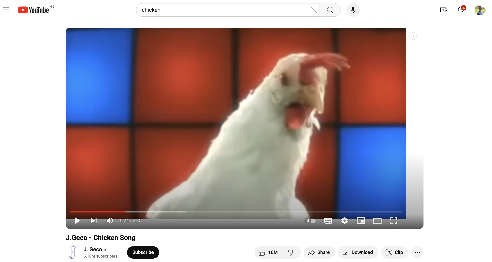

+++
author = "Matt Lilley"
title = "Recommendation rabbit holes"
date = "2024-09-28"
subtitle = "Battling the YouTube sidebar"
tags = [
    "gpt",
    "technology"
]
description="We’ve all been there... you jump onto YouTube for a 'quick' tutorial on fixing a leaky tap and before you know it you’re an hour deep into videos about the history of Roman aqueducts 😫."
+++

We’ve all been there... you jump onto YouTube for a "quick" tutorial on fixing a leaky tap and before you know it you’re an hour deep into videos about the history of Roman aqueducts 😫. It’s not that we don’t enjoy the content... quite the opposite. That’s the problem. One recommendation leads to another and another. It’s a familiar rabbit hole, and while it can be interesting, for me personally it’s becoming a huge time suck.

Initially, I looked for a browser extension to solve this, but many had user complaints about ads, intrusive behavior, and even suspicious permissions. It reminded me of how easy it is to "click, click" your way into a malware infested computer. Of course I could just make an extension myself, but I so rarely develop Chrome extensions it's just a pain to re-learn everything. Guess who came to my rescue...

ChatGPT 🙏

With GPT's help, I was able to quickly piece together a basic extension within minutes and after some tweaking around the edges... mainly me faffing around with icons... I had it all working perfectly in under an hour 🙌.

The result is quite lovely I'd say - YouTube looks so clean without the recommendations sidebar don't you think?

The final "product" (lol) completely removes YouTube recommendations with a quick click. I can choose to hide or show the sidebar whenever I like (because sometimes I might actually like a cheeky distraction). I now have control over what I see and no longer have to rely on my fleeting will power to prevent the "just one more short" reflex. Plus, I know exactly what the extension does because I <s>wrote</s> reviewed the code - no malware for me.

This mini side-project reminded me of how amazing the web is. Unlike apps, which are locked down and controlled by developers, the web allows for endless customization. I can use a few lines of JavaScript to modify how a website looks and feels, tailoring it to suit my needs. This flexibility is a reminder of why open-source software and web standards are so crucial: they give users the power to shape their own digital environments.

So yay for the web and yay for reclaiming focus and staying intentional with my online activities 💪. It's a small personal victory that you are welcome to share with me by downloading the extension and using it yourselves. You can find the code at the [no-youtube-recommendations](https://github.com/mklilley/no-youtube-recommendations) repository on Github (there's no malware, I promise 😆).